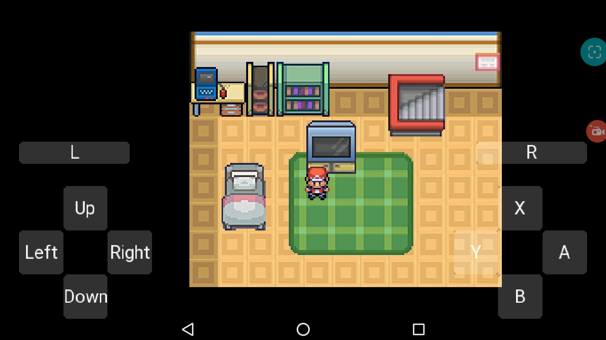
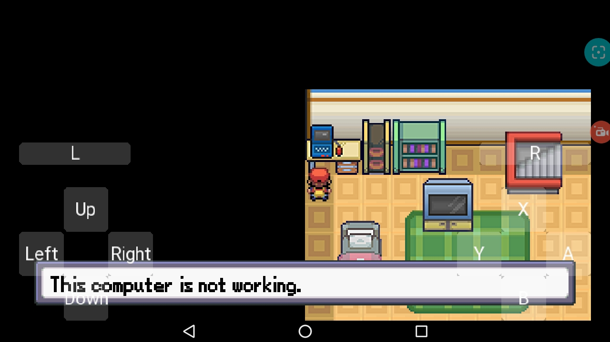
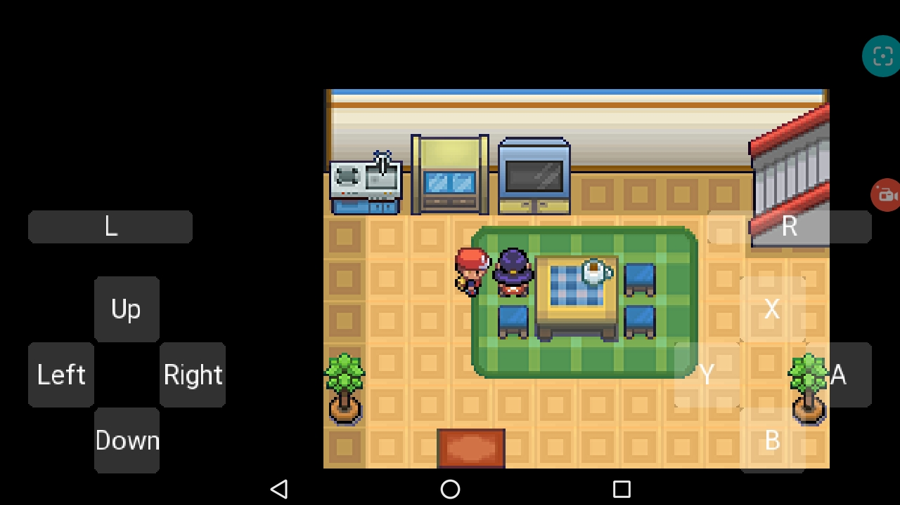
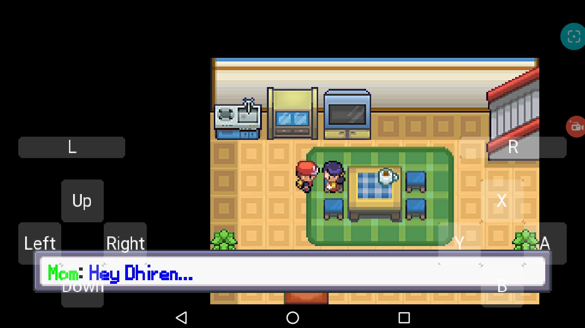
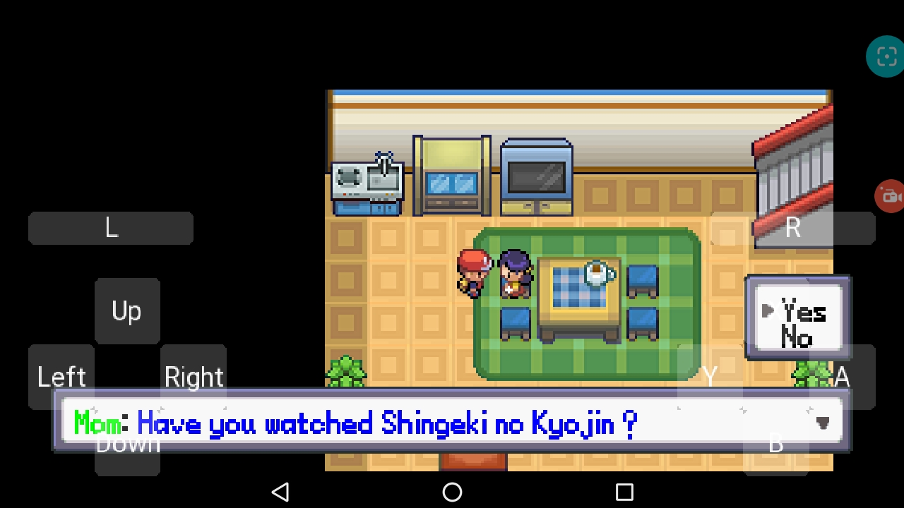
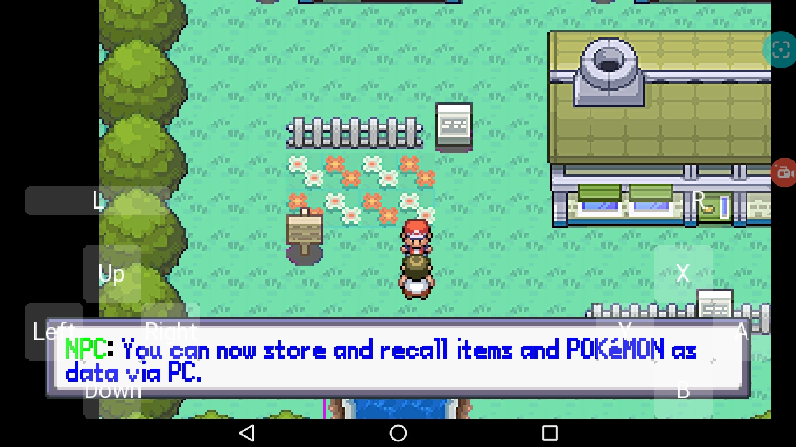
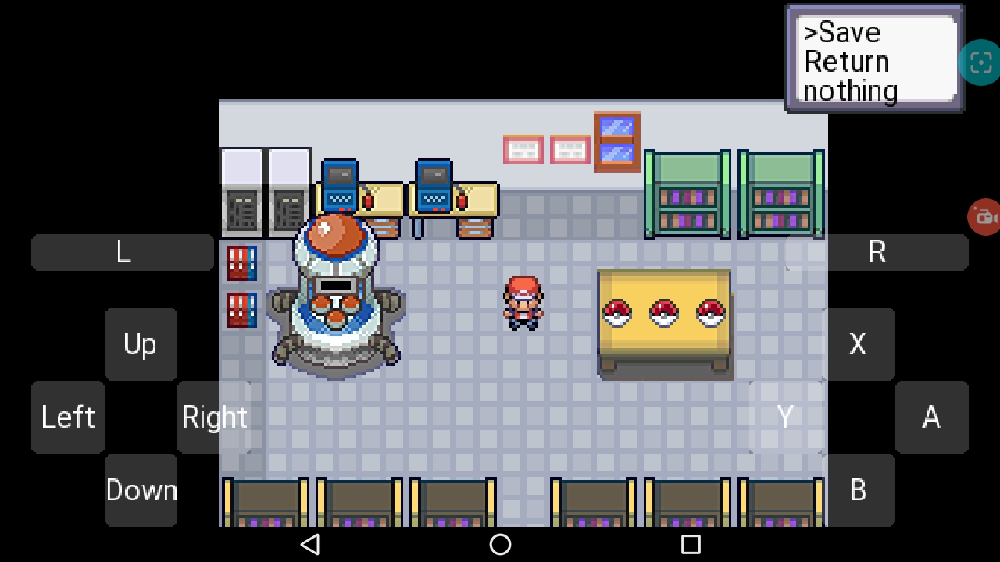
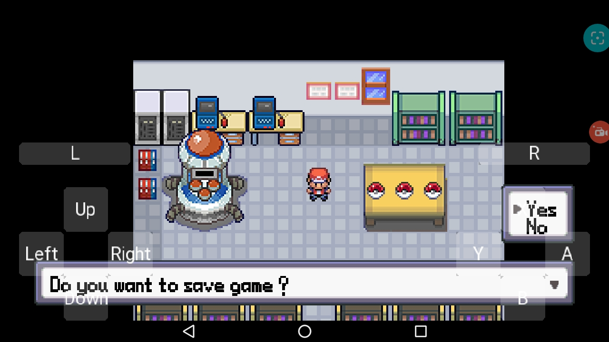
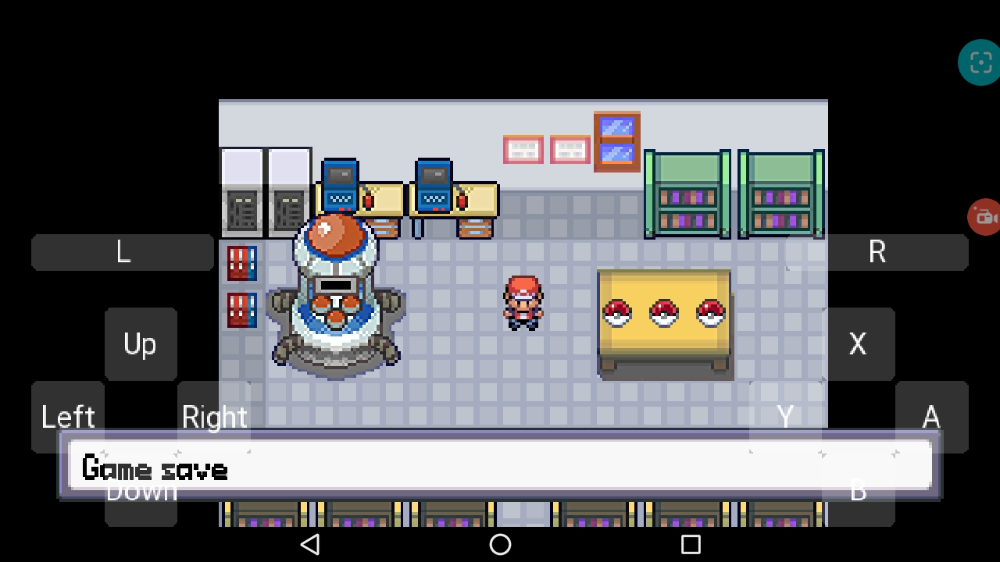

# Media

 
 
 
 
 
 

# About

This is a pokemon game i am creating in python3. It uses pygame. There are very less engine available for making pokemon fan games on Android platform, So i am currently making this one. The name of game is not decided, i am calling it pyred for now.

# Features

- Created in Python3, Pydroid3 mobile app so you can run it in mobile.
- Game save and Load (map name and player position for now)
- TMX map loading and placing warps, player, npc and collidables
- Dialog Box and Choice box
- NPC script (speech and walk)
- Fade in and Out animations (WIP)
- In game menu (WIP)
- Autorun

# To-Do

- Clean the code
- Document it
- Pokemons
- Items and Bag
- Pokedex
- Trainer Card, Gyms, Badges and much more 

# Resource used

PyTMX : [Original Repository](https://github.com/bitcraft/pytmx)
- For using tmx map
- I have modified this to match my requirments.

Pyscroll : [Original Repository](https://github.com/bitcraft/pyscroll)
- For scrolling map and camera
- I also have modified this a bit

Pygame : [Official Site](https://www.pygame.org/)
- Game engine for Python
- I am using Pygame 2 beta/dev

Other resources :
- Using sprites from Pokemon Essential RMXP
- Using maps from Pokemon Green Online (I modified everymap)

